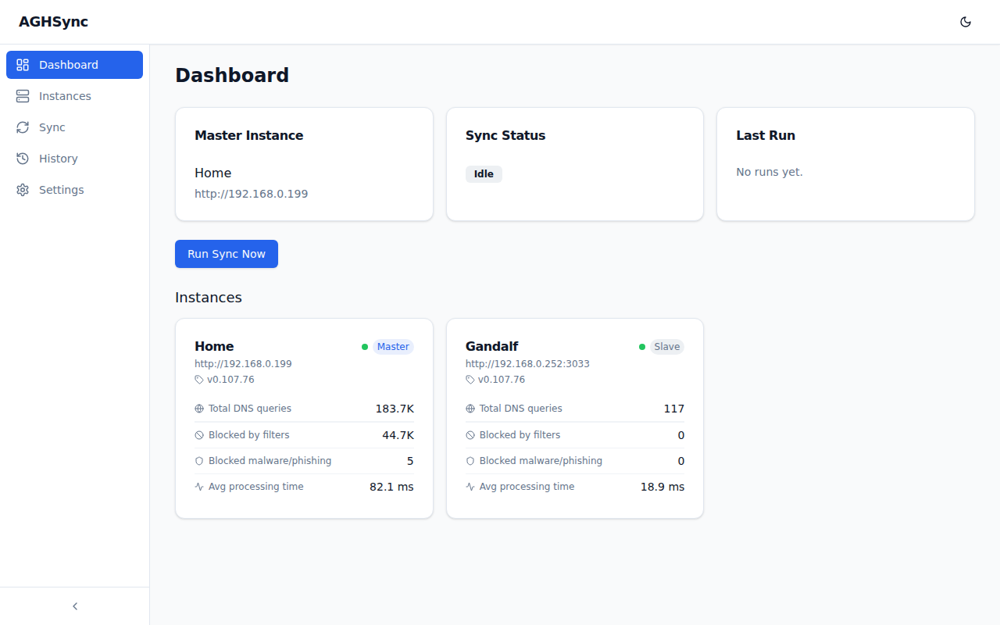
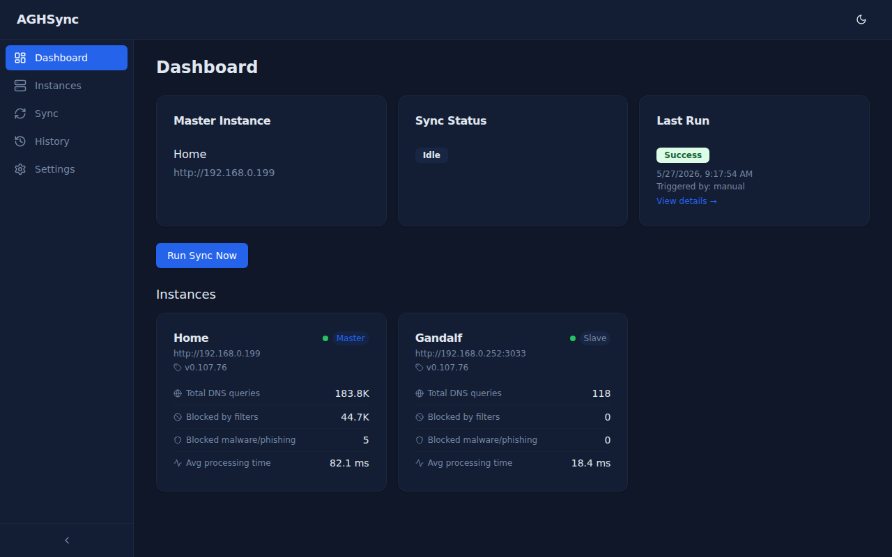
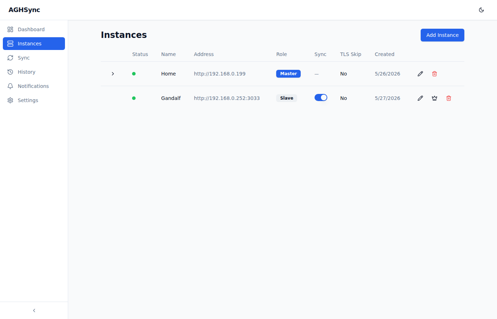
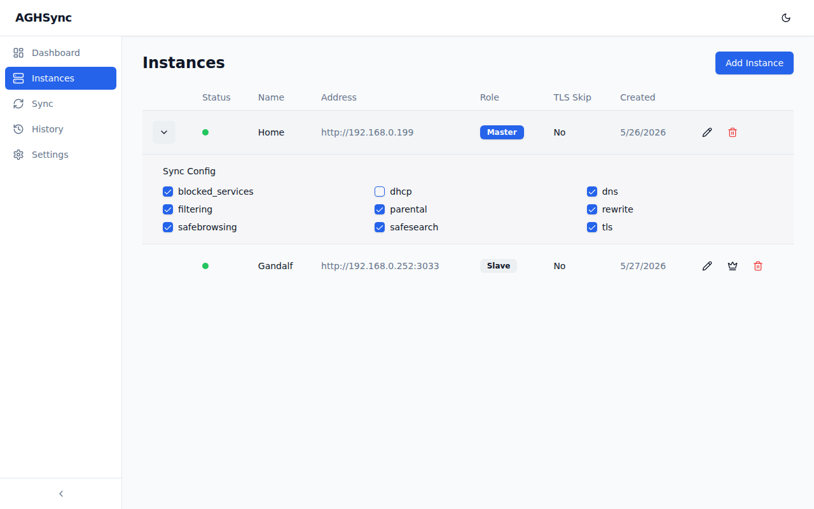
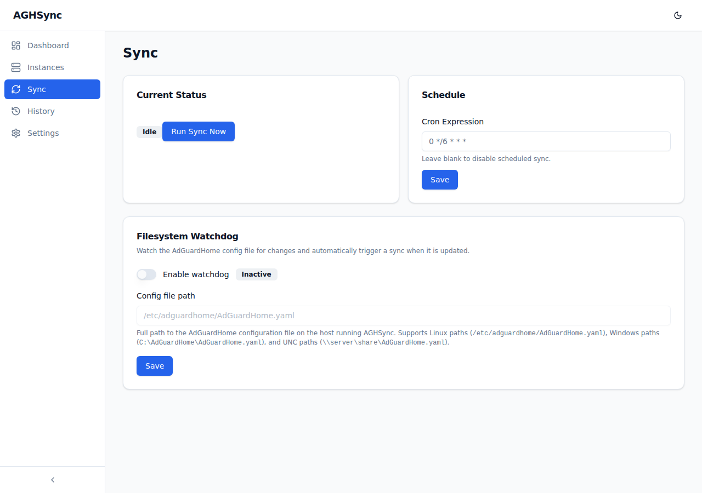
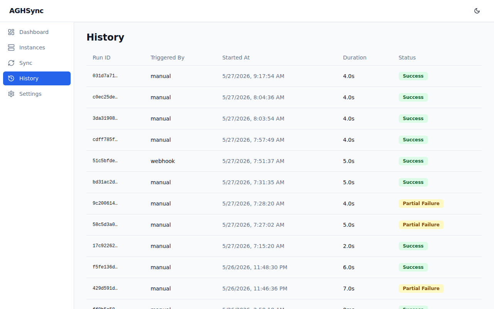
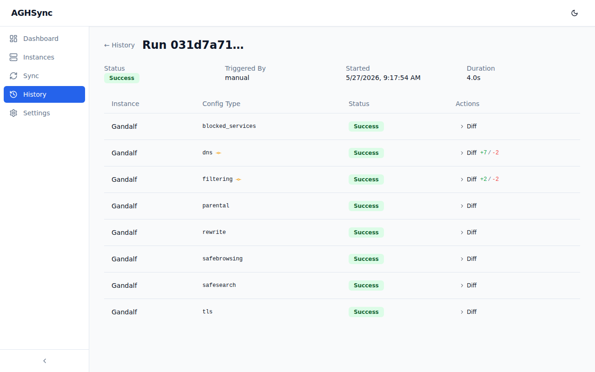
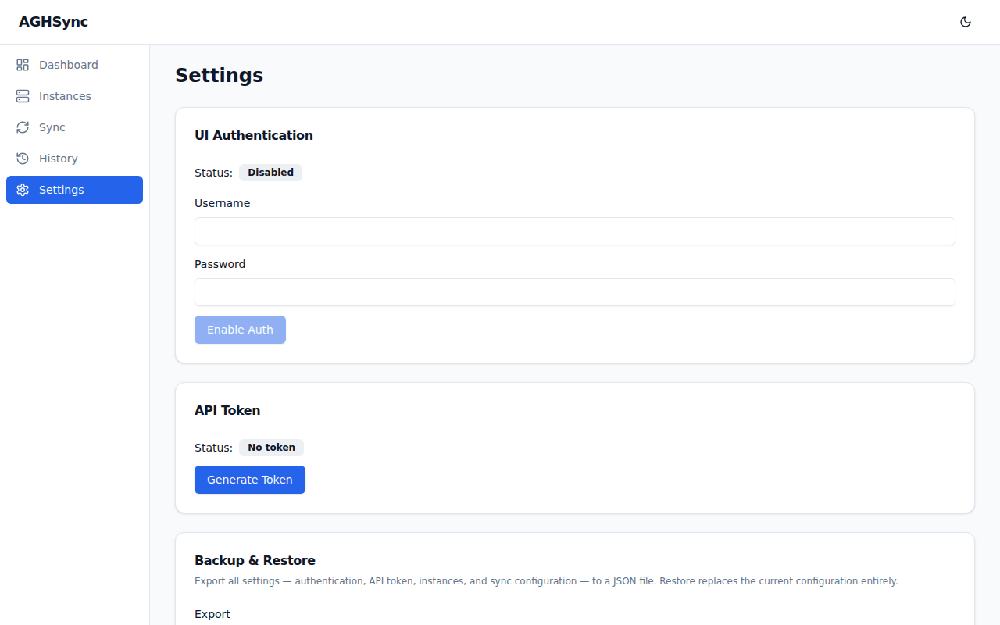

# AGHSync

**AGHSync** keeps your [AdGuardHome](https://github.com/AdguardTeam/AdGuardHome) instances in sync automatically. Designate one instance as the **master** — AGHSync propagates its configuration to every **slave** instance on a schedule, on demand, or via webhook.

---

## Screenshots

### Dashboard


### Dark Mode


### Instances


### Sync Configuration (master)


### Filesystem Watchdog


### Sync History


### Run Detail with Diff


### Settings


---

## Features

### Instance Management
- Add, edit, and delete AdGuardHome instances
- Designate one instance as **Master** — promoting a slave automatically demotes the current master and transfers its sync configuration
- Connection test with live credential validation before saving
- TLS skip-verify option per instance for self-signed certificates
- **Duplicate prevention** — each address can only be added once; a clear error is shown if you try to add the same instance twice
- **Online/Offline status** — a colored dot per instance refreshes every 60 seconds

### Synchronisation
- **Granular sync config** — the master controls which AdGuardHome configuration types are pushed to slaves via per-type checkboxes:
  - `blocked_services`, `dhcp`, `dns`, `filtering`, `parental`, `rewrite`, `safebrowsing`, `safesearch`, `tls`
- **Scheduled sync** — user-configurable cron expression (e.g. `0 * * * *` for hourly)
- **Manual run** — trigger a sync instantly from the UI or via API
- **Webhook trigger** — `POST /api/v1/webhook/sync` for external integrations (e.g. AdGuardHome post-update hooks)
- **Filesystem watchdog** — watch the AdGuardHome config file for changes and automatically trigger a sync when it is updated; supports Linux, Windows, and UNC paths; changes are debounced to handle atomic multi-step writes
- Sync runs concurrently across all slave instances

### Dashboard
- Master instance summary, live sync status, and last run result
- Per-instance stats cards showing:
  - AdGuardHome version
  - Total DNS queries
  - Blocked by filters
  - Blocked malware / phishing
  - Average DNS processing time
- Stats refresh automatically every 60 seconds

### History & Diff
- Full sync run history with status (`Success`, `Partial Failure`, `Error`), trigger source, start time, and duration
- Per-run detail view with a result row per config type and per slave
- **Change indicator** — an amber icon flags config types where a change was actually applied
- **LCS-based diff viewer** — click any row to expand a green/red unified diff showing exactly what changed, with `+N / -N` summary badge

### Settings
- **UI Authentication** — enable/disable Basic Auth for the web interface; username and password set via the UI
- **API Token** — generate a secure token for protecting the REST API; shown once and never stored in plaintext
- **Backup & Restore** — export all settings (auth config, API token hash, all instances, sync configuration) to a JSON file; import a backup to fully restore a previous state

### API
- Every UI action has an equivalent REST endpoint
- Swagger / OpenAPI documentation served at `/api/docs`
- Token-authenticated (`X-API-Token` header) or Basic Auth
- See `/api/docs` for the full endpoint reference

### Dark Mode
- System-preference-aware dark/light toggle in the navbar

---

## Quick Start

### Docker (recommended)

```bash
docker run -d \
  --name aghsync \
  -p 8080:8080 \
  -v aghsync-data:/app/data \
  techblog/aghsync:latest
```

Open [http://localhost:8080](http://localhost:8080)

### Docker Compose

```yaml
services:
  aghsync:
    image: techblog/aghsync:latest
    ports:
      - "8080:8080"
    volumes:
      - aghsync-data:/app/data
    environment:
      LOG_LEVEL: info

volumes:
  aghsync-data:
```

```bash
docker compose up -d
```

### Binary

Download the binary for your platform from the [Releases](../../releases) page.

```bash
# Linux / macOS
chmod +x aghsync-linux-amd64
./aghsync-linux-amd64

# Windows
aghsync-windows-amd64.exe
```

---

## Configuration

### CLI Flags

| Flag | Description |
|---|---|
| `--port <n>` | Listening port. Default: `8080`. Overridden by `AGHSYNC_PORT`. |
| `--log-level <level>` | `debug` / `info` / `warning` / `error`. Default: `warning`. |
| `--reset-password` | Interactively reset the UI login password. |
| `--service <action>` | Manage the OS service: `install` / `uninstall` / `start` / `stop` / `restart`. |

### Environment Variables

| Variable | Description |
|---|---|
| `AGHSYNC_PORT` | Server port — takes precedence over `--port`. |
| `LOG_LEVEL` | Log level — takes precedence over `--log-level`. |
| `AGHSYNC_DATA` | Directory for `aghsync.db`. Default: current working directory. |

Port resolution order (highest → lowest): `AGHSYNC_PORT` → `--port` → built-in default (`8080`).

---

## Supported Platforms

| OS | Architecture |
|---|---|
| Linux | amd64, arm64, armv7, armv6, 386 |
| macOS | amd64 (Intel), arm64 (Apple Silicon) |
| Windows | amd64, arm64 |

Docker images: `linux/amd64`, `linux/arm64`, `linux/arm/v7`

---

## API

The full REST API is documented at **`/api/docs`** (Swagger UI).

Key endpoints:

| Method | Path | Description |
|---|---|---|
| `GET` | `/api/v1/instances` | List all instances |
| `POST` | `/api/v1/instances` | Add an instance |
| `PUT` | `/api/v1/instances/{id}` | Update an instance |
| `DELETE` | `/api/v1/instances/{id}` | Remove an instance |
| `PUT` | `/api/v1/instances/{id}/promote` | Promote slave to master |
| `GET` | `/api/v1/instances/{id}/sync-config` | Get master sync config |
| `PUT` | `/api/v1/instances/{id}/sync-config` | Update master sync config |
| `GET` | `/api/v1/instances/statuses` | Online/offline status for all instances |
| `GET` | `/api/v1/instances/{id}/stats` | DNS stats for one instance |
| `POST` | `/api/v1/sync/run` | Trigger a manual sync |
| `GET` | `/api/v1/sync/status` | Current and last run status |
| `PUT` | `/api/v1/sync/schedule` | Update the cron schedule |
| `POST` | `/api/v1/webhook/sync` | Webhook trigger |
| `GET` | `/api/v1/history` | List sync runs |
| `GET` | `/api/v1/history/{runId}` | Run detail with per-config diffs |
| `GET` | `/api/v1/settings` | Get application settings |
| `PUT` | `/api/v1/settings/ui-auth` | Enable/disable UI auth |
| `POST` | `/api/v1/settings/api-token` | Generate API token |
| `DELETE` | `/api/v1/settings/api-token` | Remove API token |
| `PUT` | `/api/v1/settings/watchdog` | Configure filesystem watchdog |
| `GET` | `/api/v1/backup/export` | Download settings backup |
| `POST` | `/api/v1/backup/restore` | Restore from backup |

**Authentication:**
- No token configured → all `/api/v1` requests pass through (bootstrap mode)
- Token configured → requests must include `X-API-Token: <token>` **or** valid Basic Auth credentials (when UI auth is enabled)

---

## Development

```bash
# Prerequisites: Go 1.22+, Node 20+

# Start backend + frontend with hot reload
./scripts/dev.sh

# Run tests
go test ./...

# Build all release targets → dist/
./scripts/build.sh

# Build Docker image
docker build -t aghsync .
```

---

## License

[MIT](LICENSE)
